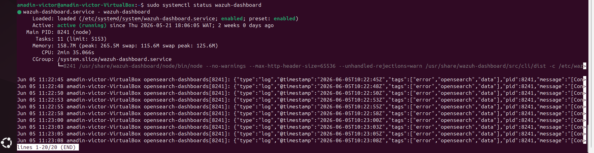

# Wazuh SIEM Deployment and Installation Lab

## Objective
To deploy a centralized Wazuh SIEM (Security Information and Event Management) platform to monitor enterprise logs, detect vulnerabilities, and track system security posture.

## Tools & Architecture Used
- **Wazuh Central Manager:** Hosted on an Ubuntu Server to collect, parse, and analyze log data.
- **Wazuh Indexer & Dashboard:** To index security events and visualize security telemetry.
- **Target Endpoints:** Configured with Wazuh agents for continuous endpoint monitoring.

## Step-by-Step Walkthrough

### 1. Preparing the Environment
Configured the host operating system with necessary system resource limits (`vm.max_map_count`) and updated dependencies to support the Wazuh stack installation components.

### 2. Installing the Wazuh Central Stack

Executed the deployment script to configure the unified Wazuh Indexer, Manager, and Dashboard services securely using production-ready SSL/TLS certificates.

### 3. Verifying Installation & Dashboard Access
Successfully verified that all core services were active and operational. I logged into the centralized web UI console to confirm the deployment status.

### Deployment Evidence & Visual Verification
Below are the screenshots captured during the successful setup and verification of the deployment environment:

#### Installation Evidence 1:

#### Installation Evidence 2:

## Conclusion
The Wazuh server stack was successfully deployed and secured. With the central monitoring infrastructure operational, the environment is fully prepared to ingest agent telemetry, parse syslogs, and generate real-time security alert indicators for incident response workflows.
