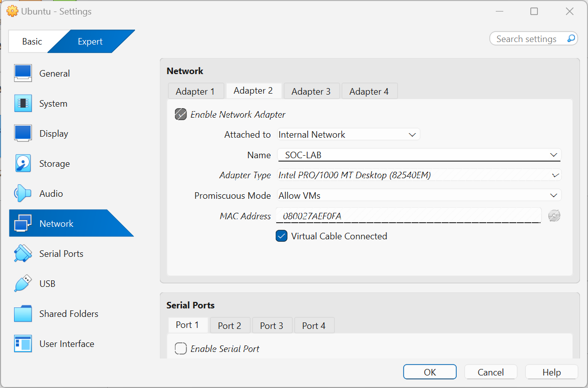
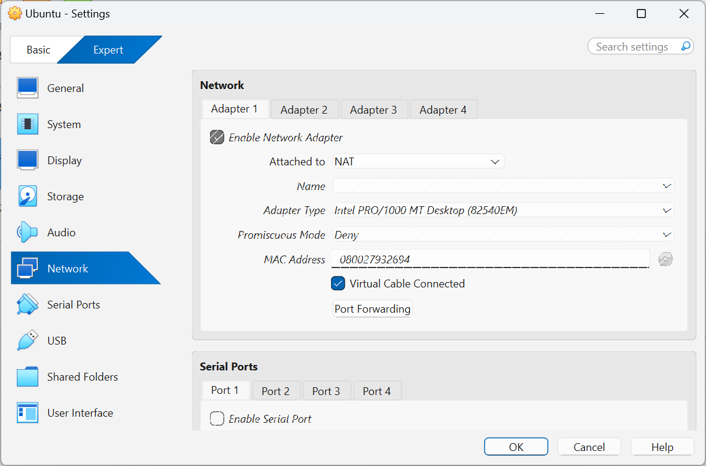
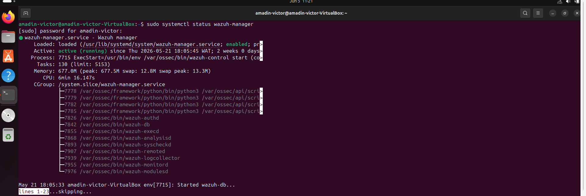
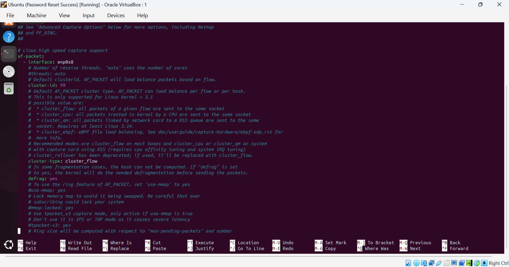
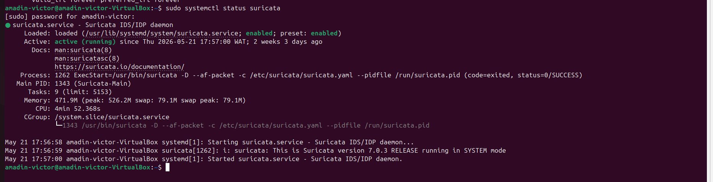
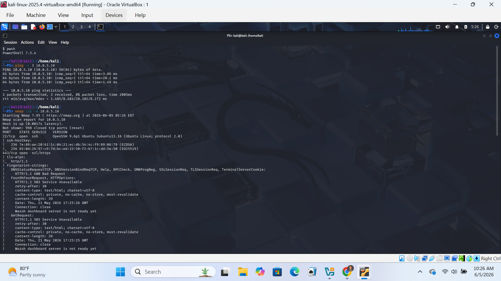
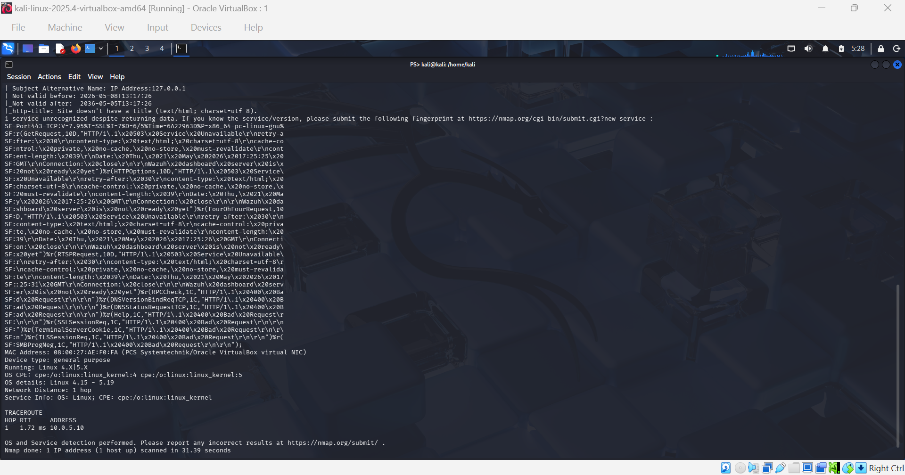
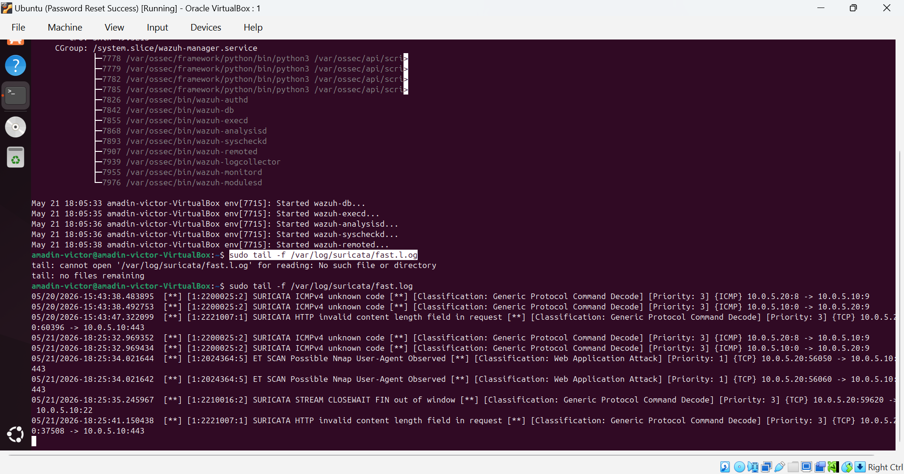

# Home SOC Lab

## Overview

This project involved building a home Security Operations Center (SOC) lab using Wazuh, Suricata, Kali Linux, Ubuntu, and VirtualBox. The lab was designed to simulate attacks, monitor network traffic, generate alerts, and investigate suspicious activity in a controlled virtual environment.

# Lab Architecture

* Ubuntu VM → Wazuh SIEM + Suricata IDS
* Kali Linux VM → Attack simulation machine
* VirtualBox → Virtualization platform
* Internal Network → Isolated lab communication
* NAT Adapter → Internet connectivity

# Objectives

* Deploy a SIEM solution
* Configure IDS monitoring
* Simulate attacks using Kali Linux
* Detect reconnaissance activity
* Investigate security alerts
* Gain hands-on SOC analyst experience

# Technologies Used

| Technology | Purpose                    |
| ---------- | -------------------------- |
| Wazuh      | SIEM and log monitoring    |
| Suricata   | Intrusion Detection System |
| Kali Linux | Attack simulation          |
| Ubuntu     | Monitoring server          |
| VirtualBox | Virtualization             |
| Nmap       | Network scanning           |

# Network Configuration

The environment was configured using two network adapters:

1. NAT Adapter

* Provided internet access for updates and package installation

2. Internal Network Adapter

* Allowed isolated communication between virtual machines
* Enabled secure attack simulation without exposing the home network
  ##Internal Network
  
  
  
  

# Wazuh Deployment

Installed and configured Wazuh SIEM on the Ubuntu monitoring server to:

* collect logs
* monitor events
* generate alerts
* investigate suspicious activity

Verified service availability using systemctl and the Wazuh dashboard.
  ##Wazuh Deplyment
  
 
 

# Suricata IDS Configuration

Configured Suricata IDS to monitor traffic on the internal lab network interface.

Updated IDS rules and monitored reconnaissance traffic generated from the Kali Linux machine.
 ## suricata configuration
 
 
 

# Attack Simulation

Simulated reconnaissance activity using Nmap from Kali Linux against the Ubuntu monitoring server.

Example command used:
nmap -sS -A 10.0.5.10

##Attack Stimulation and Detection

# Skills Learned

* SIEM deployment
* IDS configuration
* Linux administration
* Threat detection
* Network segmentation
* Alert investigation
* Virtual machine management
* Security monitoring

# Lessons Learned

This project improved understanding of:

* SOC workflows
* attack visibility
* network monitoring
* packet inspection
* IDS troubleshooting
* security event investigation

The project also provided hands-on experience troubleshooting Suricata interface configuration and integrating security monitoring tools within a virtualized lab environment.
